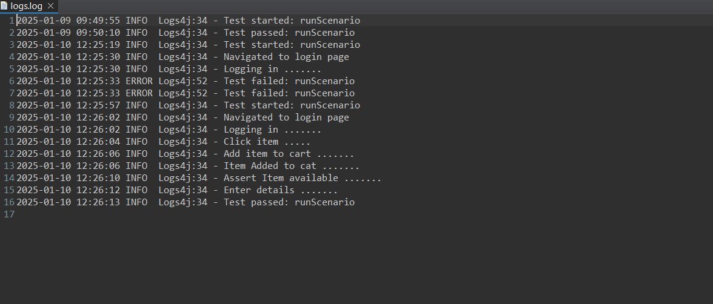
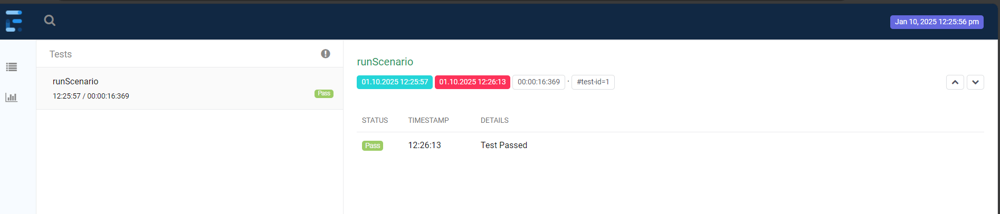
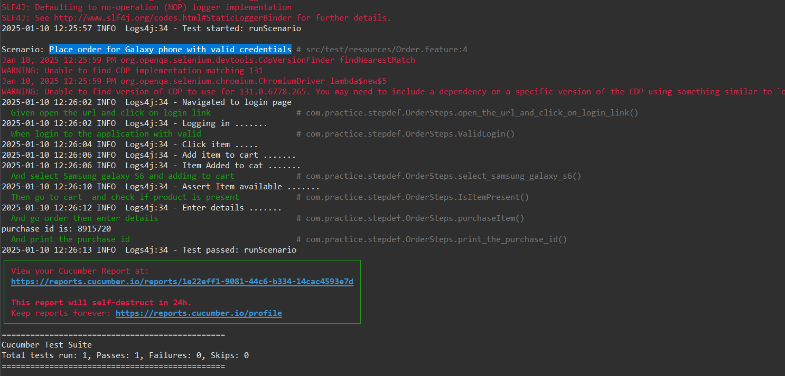

# DemoBlaze

## Test Scenario
Place order for Galaxy phone with valid credentials

## Objective
To test the process of logging in, selecting a Samsung Galaxy S6, adding it to the cart, placing an order, and retrieving the purchase ID.

## Test Steps

1.**Login**
  - Open the login page of the application.
  - Enter the following credentials:
    - Username: admin
    - Password: admin
  - Click on the Login button.
  - Verify that the login is successful and the user is redirected to the homepage/dashboard.
2. **Select Samsung Galaxy S6**

  - From the homepage or the product catalog, locate the Samsung Galaxy S6.
  - Click on the Samsung Galaxy S6 to navigate to the product details page.
  - Verify that the correct product details (price, specifications, etc.) are displayed.
3.**Add to Cart**

  - On the product details page, click the Add to Cart button.
  - Verify that the product is successfully added to the cart by checking the cart icon for the correct quantity and product.
    
4.**Place Order**

  - Navigate to the Cart by clicking on the cart icon.
  - Click on the Proceed to Checkout button.
  - Enter random data in the required fields (name, shipping address, contact information, etc.).
  - Click on the Place Order button.
  - Verify that the order is placed successfully and a purchase ID is generated.
    
5.**Retrieve Purchase ID**

  - After placing the order, verify that a purchase ID is displayed on the order confirmation page.
  - Copy the purchase ID.

## Reporting

        

